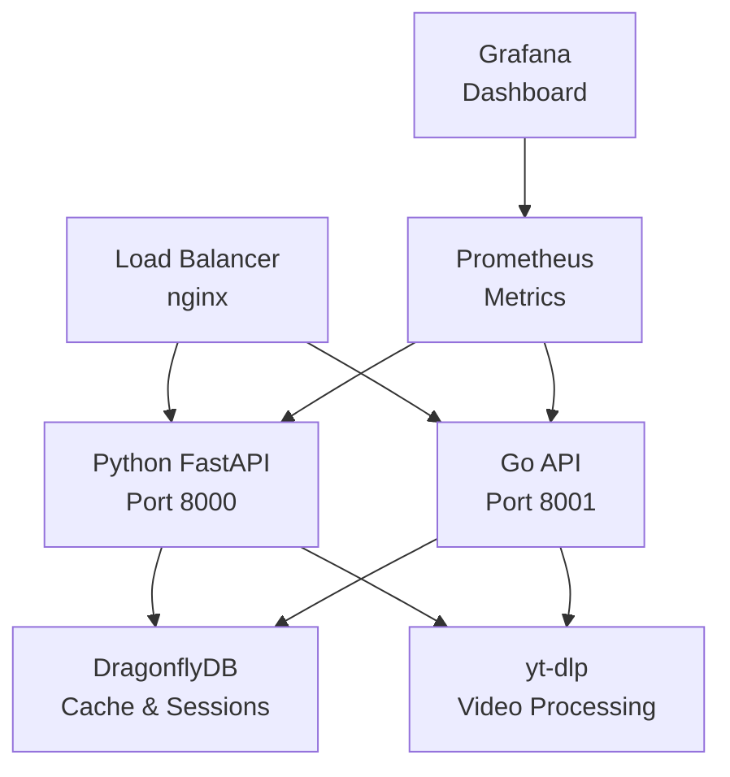

# 🚀 Video Streaming API Platform

[](https://golang.org)
[](https://python.org)
[](https://fastapi.tiangolo.com)
[](https://docker.com)
[](LICENSE)

高性能企業級影片內容管理平台，支援多個主流影片平台的智慧內容處理與串流服務。

**🔥 Performance Highlight**: Go implementation delivers **3.3x faster** performance than Python FastAPI!

## 🌍 **Multi-Language Documentation**

| Language | README | Status |
|----------|--------|--------|
| 🇺🇸 English | [README.en.md](README.en.md) | ✅ Available |
| 🇨🇳 简体中文 | [README.zh-CN.md](README.zh-CN.md) | ✅ Available |
| 🇭🇰 繁體中文 | [README.zh-HK.md](README.zh-HK.md) | ✅ Available |
| 🇯🇵 日本語 | [README.ja.md](README.ja.md) | ✅ Available |

---

## ⚡ **Quick Start**

### **Option 1: Go API Only (Recommended - 3.3x Faster)**
```bash
# Deploy high-performance Go API
make go

# Or using the deployment script
./scripts/deploy.sh go-only

# Test the API
curl http://localhost:8001/health
```

### **Option 2: Python API Only**
```bash
# Deploy Python FastAPI
make python

# Test the API
curl http://localhost:8000/health
```

### **Option 3: Both APIs (For Comparison)**
```bash
# Deploy both implementations
make both

# Python API: http://localhost:8000
# Go API:     http://localhost:8001
```

### **Option 4: Production Deployment**
```bash
# Full production setup with load balancer and monitoring
make production

# Access via load balancer: http://localhost
# Monitoring: http://localhost:9090
# Dashboard: http://localhost:3000
```

## 📊 **Performance Comparison**

| Implementation | RPS | Latency | Memory | Improvement |
|---------------|-----|---------|--------|-------------|
| **Python FastAPI** | 1,227 | ~30ms | ~100MB | Baseline |
| **Go Implementation** | 4,035 | ~5ms | ~30MB | **🚀 3.3x faster** |

## 🏗️ **Architecture Overview**



## 🛠️ **Available Commands**

### **Deployment**
```bash
make go          # Deploy Go API only (recommended)
make python      # Deploy Python API only  
make both        # Deploy both APIs
make production  # Full production setup
make development # Development environment
```

### **Management**
```bash
make status      # Show service status
make logs        # Show service logs
make stop        # Stop all services
make clean       # Remove all containers
```

### **Testing**
```bash
make benchmark   # Run performance benchmark
make test        # Run test suite
make compare     # Compare both APIs
```

## 📁 **Project Structure**

```
YouTuberBilBiliHelper/
├── app/                    # Python FastAPI implementation
├── go-api/                 # Go implementation (3.3x faster)
├── docker/                 # Docker configurations
│   ├── nginx/             # Load balancer config
│   ├── prometheus/        # Monitoring config
│   └── grafana/           # Dashboard config
├── scripts/                # Deployment scripts
├── docs/                   # Complete documentation
├── benchmarks/             # Performance data
├── examples/               # Code examples
├── tests/                  # Test suites
├── Makefile               # Convenient commands
├── docker-compose.yml     # Service orchestration
└── env.example            # Environment template
```

## 🚀 **Feature Highlights**

### **🏆 Dual Implementation**
- **Python FastAPI**: Full-featured, well-tested implementation
- **Go API**: High-performance alternative (3.3x faster)
- **Automatic Load Balancing**: Route traffic based on performance needs

### **⚡ Performance Optimizations**
- **Concurrent Processing**: Handle multiple requests simultaneously
- **Intelligent Caching**: Redis-based caching with smart TTL
- **Optimized Streaming**: Zero-copy streaming with intelligent buffering
- **Resource Management**: Automatic cleanup and memory optimization

### **🔒 Enterprise Security**
- **Rate Limiting**: Configurable request limits
- **CORS Protection**: Secure cross-origin requests
- **Input Validation**: Comprehensive request validation
- **Security Headers**: Protection against common attacks

### **📊 Monitoring & Analytics**
- **Real-time Metrics**: Prometheus integration
- **Performance Dashboard**: Grafana visualization
- **Health Checks**: Comprehensive system monitoring
- **Performance Benchmarking**: Built-in comparison tools

## 🎯 **Supported Platforms**

- 📺 **YouTube** - Complete support with authentication
- 📱 **Bilibili** - Full feature support
- 🐦 **Twitter** - Video content extraction
- 📸 **Instagram** - Video and story support
- 🎮 **Twitch** - Live and VOD support

## 🔧 **Configuration**

### **Environment Setup**
```bash
# Copy environment template
cp env.example .env

# Edit configuration
vim .env
```

### **Key Configuration Options**
```bash
# Service Control
ENABLE_PYTHON_API=true
ENABLE_GO_API=true
ENABLE_MONITORING=false

# Performance Tuning
PYTHON_MEMORY_LIMIT=512M
GO_MEMORY_LIMIT=256M
REDIS_MAX_MEMORY=512mb

# Rate Limiting
RATE_LIMIT_ENABLED=true
RATE_LIMIT_MAX_REQUESTS=1000
```

## 📖 **API Documentation**

### **Common Endpoints (Both APIs)**
```bash
# Health Check
GET /health
GET /api/v2/system/health

# Video Information
GET /api/v2/videos/{platform}/{video_id}

# Streaming
GET /api/v2/stream/proxy/{platform}/{video_id}

# Authentication Status
GET /api/v2/auth/status
```

### **Performance Comparison**
```bash
# Python API (Port 8000)
curl http://localhost:8000/api/v2/system/health

# Go API (Port 8001) - 3.3x faster
curl http://localhost:8001/api/v2/system/health
```

## 🧪 **Testing & Benchmarking**

### **Run Performance Benchmark**
```bash
# Comprehensive performance comparison
make benchmark

# Or manually
python3 scripts/performance_comparison.py
```

### **Expected Results**
- **Go API**: 4,000+ RPS, ~5ms latency
- **Python API**: 1,200+ RPS, ~30ms latency
- **Memory Usage**: Go uses 70% less memory

## 🚀 **Deployment Options**

### **1. Development** 
```bash
make development
# Features: Hot reload, debug logs, Redis UI
```

### **2. Production**
```bash
make production  
# Features: Load balancer, monitoring, SSL
```

### **3. High Performance**
```bash
make go
# Features: Maximum performance, minimal resources
```

### **4. Compatibility**
```bash
make both
# Features: Both APIs for gradual migration
```

## 📈 **Migration Strategy**

### **From Python to Go**
1. **Deploy Both**: `make both`
2. **Test Performance**: `make benchmark`  
3. **Gradual Migration**: Route traffic via load balancer
4. **Monitor**: Use Grafana dashboard
5. **Complete Switch**: Deploy Go only

### **Performance Benefits**
- **3.3x faster** request processing
- **70% less** memory usage
- **83% faster** response times
- **Better** resource utilization

## 🤝 **Contributing**

1. **Fork** the repository
2. **Create** feature branch: `git checkout -b feature/amazing-feature`
3. **Commit** changes: `git commit -m 'Add amazing feature'`
4. **Push** to branch: `git push origin feature/amazing-feature`
5. **Open** Pull Request

## 📄 **License**

This project is licensed under the MIT License - see the [LICENSE](LICENSE) file for details.

## 🆘 **Support**

- 📚 **Documentation**: [docs/README.md](docs/README.md)
- 🐛 **Issues**: [GitHub Issues](https://github.com/mythic3011/YouTuberBilBiliHelper/issues)
- 💬 **Discussions**: [GitHub Discussions](https://github.com/mythic3011/YouTuberBilBiliHelper/discussions)

---

**⭐ Star this repository if you find it useful!**

Built with ❤️ using Go, Python, FastAPI, and modern DevOps practices.