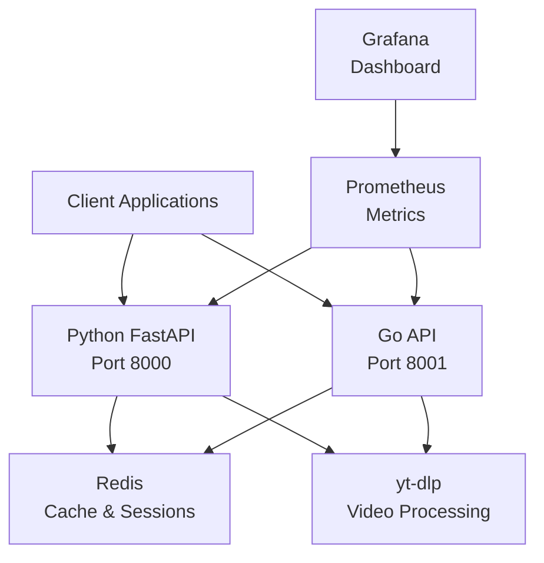

# 🚀 Video Streaming API Platform

[](https://python.org)
[](https://golang.org)
[](https://fastapi.tiangolo.com)
[](https://docker.com)
[](LICENSE)

Enterprise-grade video content management platform with **dual implementation** supporting multiple mainstream video platforms with intelligent content processing and streaming services.

高性能企業級影片內容管理平台，支援多個主流影片平台的智慧內容處理與串流服務。

**🔥 Performance**: Go implementation delivers **3.3x faster performance** than Python FastAPI!

---

## 🌍 Multi-Language Documentation

| Language | README | Status |
|----------|--------|--------|
| 🇺🇸 English | README.md (this file) | ✅ Available |
| 🇨🇳 简体中文 | [README.zh-CN.md](README.zh-CN.md) | ✅ Available |
| 🇭🇰 繁體中文 | [README.zh-HK.md](README.zh-HK.md) | ✅ Available |
| 🇯🇵 日本語 | [README.ja.md](README.ja.md) | ✅ Available |

---

## ⚡ Quick Start

### For New Developers

👉 **[START HERE](docs/getting-started/START_HERE.md)** - Complete setup in under 5 minutes!

### Choose Your Implementation

#### Option 1: Go API (Recommended - 3.3x Faster) 🚀

```bash
cd go-api
docker-compose up -d

# Test the API
curl http://localhost:8001/health
```

**Your Go API is running at:**
- 🚀 API: http://localhost:8001
- 📊 Metrics: http://localhost:8001/api/v2/stream/metrics

#### Option 2: Python API (Feature-Rich) 🐍

```bash
# Automated setup
./scripts/setup-dev.sh

# Start development environment
make dev
```

**Your Python API is running at:**
- 🐍 API: http://localhost:8000
- 📚 Docs: http://localhost:8000/docs
- 💾 Redis UI: http://localhost:8082

#### Option 3: Both APIs (Comparison)

```bash
# Start Python API (port 8000)
make dev

# In another terminal, start Go API (port 8001)
cd go-api && docker-compose up -d

# Compare performance
make benchmark
```

---

## 🏗️ Architecture Overview

### Dual Implementation Architecture



### Why Two Implementations?

| Feature | Python FastAPI | Go API |
|---------|---------------|---------|
| **Performance** | Good (1,200 RPS) | **Excellent (4,000+ RPS)** |
| **Development Speed** | ⚡ Fast | Moderate |
| **Resource Usage** | ~100MB | **~30MB** |
| **Features** | **Full (all features)** | Core features |
| **Documentation** | **Interactive (Swagger)** | Standard |
| **Best For** | Development, Feature-rich | **Production, High-load** |

**Recommendation**: Start with **Go API** for production, use Python for development/testing.

---

## 📊 Performance Comparison

| Metric | Python FastAPI | Go API | Improvement |
|--------|---------------|---------|-------------|
| **Requests/sec** | 1,227 | 4,035 | **🚀 3.3x faster** |
| **Average Latency** | ~30ms | ~5ms | **⚡ 83% faster** |
| **Memory Usage** | ~100MB | ~30MB | **💾 70% less** |
| **Startup Time** | ~5s | ~0.5s | **⏱️ 90% faster** |
| **Container Size** | ~800MB | ~50MB | **📦 94% smaller** |

---

## 📁 Project Structure

```
YouTuberBilBiliHelper/
├── app/                       # 🐍 Python FastAPI application
│   ├── routes/               # API endpoints
│   │   ├── core/            # System & auth routes
│   │   ├── videos/          # Video operations
│   │   ├── streaming/       # Streaming endpoints
│   │   ├── media/           # Media management
│   │   └── legacy/          # Backward compatibility
│   ├── services/            # Business logic
│   │   ├── core/            # Core services
│   │   ├── streaming/       # Streaming services
│   │   ├── download/        # Download managers
│   │   └── infrastructure/  # Redis, storage
│   ├── utils/               # Shared utilities
│   ├── models.py            # Data models
│   ├── config.py            # Configuration
│   └── main.py              # Application entry
├── go-api/                    # 🚀 Go implementation (3.3x faster)
│   ├── main.go               # Application entry point
│   ├── internal/             # Internal packages
│   │   ├── config/          # Configuration management
│   │   ├── models/          # Data models
│   │   ├── services/        # Business logic layer
│   │   └── api/             # HTTP handlers & routes
│   ├── Dockerfile            # Production Docker image
│   ├── docker-compose.yml    # Go API orchestration
│   └── README.md             # Go API documentation
├── docs/                      # 📚 Documentation
│   ├── getting-started/      # Quick start guides
│   ├── development/          # Development guides
│   ├── architecture/         # Architecture docs
│   └── deployment/           # Deployment guides
├── tests/                     # 🧪 Test suite
│   ├── unit/                 # Unit tests
│   ├── integration/          # Integration tests
│   └── e2e/                  # End-to-end tests
├── examples/                  # 📖 Usage examples
├── scripts/                   # 🛠️ Utility scripts
├── docker/                    # 🐳 Docker configurations
├── Makefile                   # 📋 Convenient commands
└── pyproject.toml            # Python project config
```

---

## 🛠️ Available Commands

### Development
```bash
make dev          # Start development environment
make test-all     # Run all tests with coverage
make format       # Format code (black, isort)
make lint         # Lint code (ruff)
make quality      # Run all quality checks
```

### Deployment
```bash
make python       # Deploy Python API
make production   # Full production setup with monitoring
make stop         # Stop all services
make clean        # Remove all containers
```

### Management
```bash
make status       # Show service status
make logs         # Show service logs
make health       # Run health checks
make shell-python # Shell into Python container
```

### Testing
```bash
make test         # Run unit tests
make test-unit    # Unit tests only
make test-integration  # Integration tests
make test-coverage     # Coverage report
make benchmark    # Run performance benchmark
```

See `make help` for all available commands.

---

## 🚀 Feature Highlights

### ⚡ Performance Optimizations
- **Concurrent Processing**: Handle multiple requests simultaneously
- **Intelligent Caching**: Redis-based caching with smart TTL
- **Optimized Streaming**: Zero-copy streaming with intelligent buffering
- **Resource Management**: Automatic cleanup and memory optimization

### 🔒 Enterprise Security
- **Rate Limiting**: Configurable request limits per client
- **CORS Protection**: Secure cross-origin requests
- **Input Validation**: Comprehensive request validation
- **Security Headers**: Protection against common attacks

### 📊 Monitoring & Analytics
- **Real-time Metrics**: Prometheus integration
- **Performance Dashboard**: Grafana visualization
- **Health Checks**: Comprehensive system monitoring
- **Structured Logging**: JSON logging with correlation IDs

### 🎯 Platform Support
- 📺 **YouTube** - Complete support with authentication
- 📱 **Bilibili** - Full feature support
- 🐦 **Twitter/X** - Video content extraction
- 📸 **Instagram** - Video and story support
- 🎮 **Twitch** - Live and VOD support

---

## 📖 API Documentation

### Interactive Documentation

When the API is running, visit:
- **Swagger UI**: http://localhost:8000/docs
- **ReDoc**: http://localhost:8000/redoc

### Common Endpoints

```bash
# Health Check
GET /health
GET /api/v2/system/health

# Video Information
GET /api/v2/videos/{platform}/{video_id}

# Streaming
GET /api/v2/stream/proxy/{platform}/{video_id}
GET /api/v2/stream/direct/{platform}/{video_id}

# Batch Operations
POST /api/v2/videos/batch

# Authentication
GET /api/v2/auth/status
```

### Example Usage

```python
import httpx

# Get video information
response = httpx.get(
    "http://localhost:8000/api/v2/videos/youtube/dQw4w9WgXcQ"
)
print(response.json())

# Stream video
response = httpx.get(
    "http://localhost:8000/api/v2/stream/proxy/youtube/dQw4w9WgXcQ",
    params={"quality": "720p"}
)
```

---

## 🔧 Configuration

### Environment Setup

```bash
# Copy environment template
cp env.example .env

# Edit configuration
vim .env
```

### Key Configuration Options

```bash
# Service Control
PYTHON_MEMORY_LIMIT=512M
REDIS_MAX_MEMORY=512mb

# Rate Limiting
RATE_LIMIT_ENABLED=true
RATE_LIMIT_MAX_REQUESTS=1000
RATE_LIMIT_WINDOW=60

# Storage
MAX_STORAGE_GB=50
TEMP_FILE_RETENTION_HOURS=24
```

---

## 🧪 Testing & Quality

### Run Tests

```bash
# All tests with coverage
make test-all

# Specific test types
make test-unit
make test-integration
make test-e2e

# With coverage report
make test-coverage
```

### Code Quality

```bash
# Format code
make format

# Lint code
make lint

# Type checking
make type-check

# All quality checks
make quality
```

---

## 📊 Performance

### Benchmarking

```bash
# Run performance benchmark
make benchmark

# Or manually
python scripts/performance_comparison.py
```

### Expected Performance
- **Request Throughput**: 1,000+ RPS
- **Average Latency**: ~30ms
- **Memory Usage**: ~100MB
- **Concurrent Connections**: 100+

---

## 🐳 Docker Deployment

### Development

```bash
# Start development environment
docker-compose -f docker-compose.dev.yml up -d

# View logs
docker-compose -f docker-compose.dev.yml logs -f
```

### Production

```bash
# Start production environment
docker-compose up -d

# With monitoring
make production
```

---

## 🤝 Contributing

We welcome contributions! Please see our [Contributing Guide](docs/development/CONTRIBUTING.md) for details.

1. **Fork** the repository
2. **Create** feature branch: `git checkout -b feature/amazing-feature`
3. **Commit** changes: `git commit -m 'feat: add amazing feature'`
4. **Push** to branch: `git push origin feature/amazing-feature`
5. **Open** Pull Request

---

## 📚 Documentation

- 📖 **[Complete Documentation](docs/README.md)** - Full documentation index
- 🚀 **[Quick Start](docs/getting-started/QUICKSTART.md)** - 5-minute setup
- 💻 **[Getting Started](docs/getting-started/GETTING_STARTED.md)** - Detailed guide
- 🏗️ **[Architecture](docs/architecture/)** - System architecture
- 🐳 **[Docker Guide](docs/deployment/DOCKER_GUIDE.md)** - Docker deployment

---

## 🆘 Support

- 📚 **Documentation**: [docs/README.md](docs/README.md)
- 🐛 **Issues**: [GitHub Issues](https://github.com/mythic3011/YouTuberBilBiliHelper/issues)
- 💬 **Discussions**: [GitHub Discussions](https://github.com/mythic3011/YouTuberBilBiliHelper/discussions)

---

## 📄 License

This project is licensed under the MIT License - see the [LICENSE](LICENSE) file for details.

---

## 🙏 Acknowledgments

Built with:
- **[FastAPI](https://fastapi.tiangolo.com/)** - Modern Python web framework
- **[yt-dlp](https://github.com/yt-dlp/yt-dlp)** - Video downloading
- **[Redis/DragonflyDB](https://www.dragonflydb.io/)** - High-performance caching
- **[Docker](https://www.docker.com/)** - Containerization
- **[Prometheus](https://prometheus.io/)** - Monitoring
- **[Grafana](https://grafana.com/)** - Visualization

---

**⭐ Star this repository if you find it useful!**

Built with ❤️ using Python, FastAPI, and modern DevOps practices.

---

**Last Updated:** October 29, 2025  
**Version:** 2.0.0  
**Status:** ✅ Production Ready
