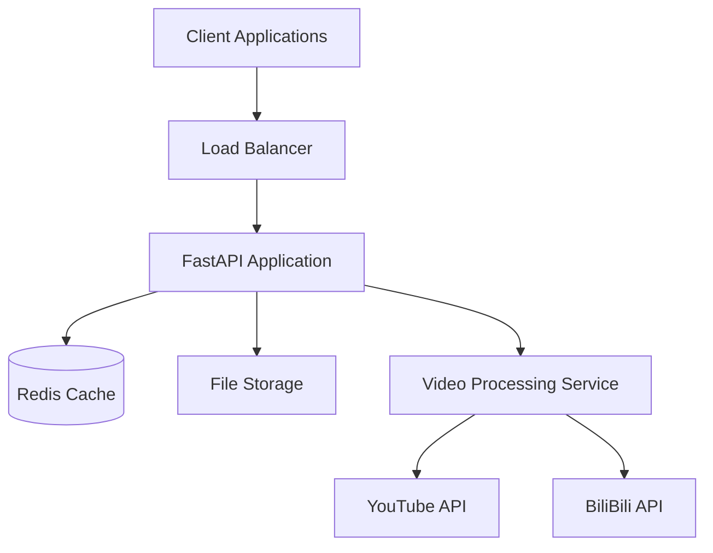
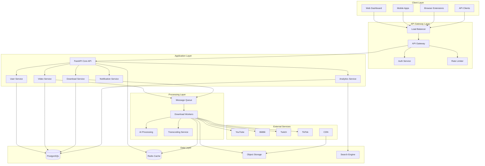
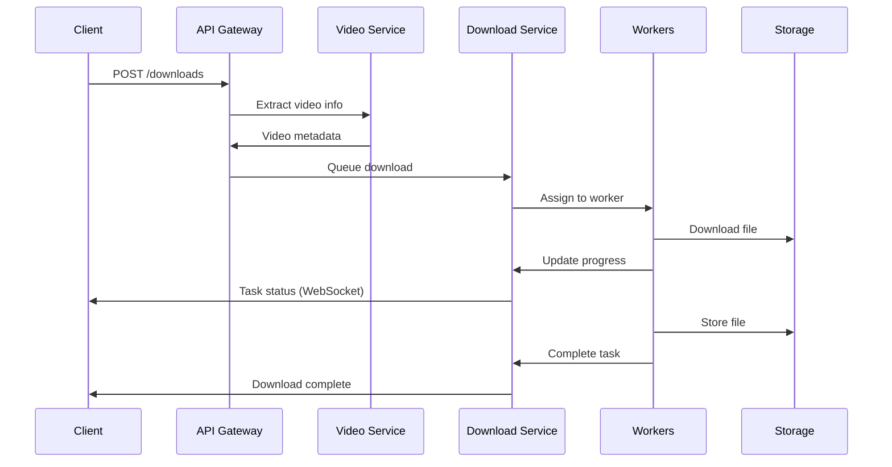
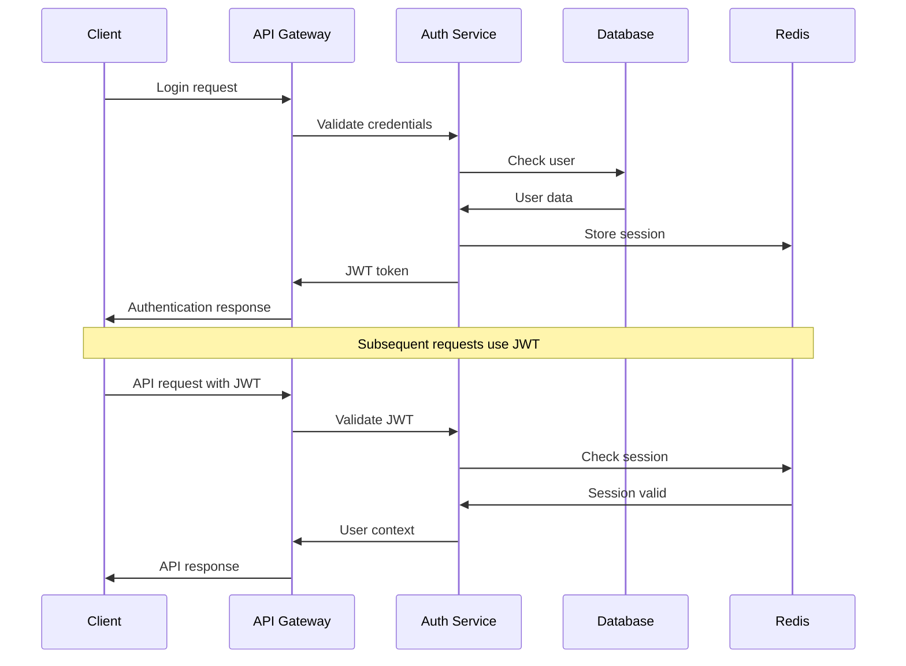

# YouTuberBilBiliHelper - Technical Architecture Document

## 🏗️ System Architecture Overview

This document outlines the technical architecture for the enhanced YouTuberBilBiliHelper platform, designed to support the features outlined in the improvement plan.

## 📐 Current Architecture (v2.0)



### Current Components
- **FastAPI Application**: Main API server
- **Redis**: Caching and rate limiting
- **File Storage**: Local file system
- **Video Processing**: yt-dlp integration
- **Docker**: Containerized deployment

## 🎯 Target Architecture (v3.0)



## 🔧 Microservices Architecture

### Core Services

#### 1. API Gateway Service
**Responsibility**: Request routing, authentication, rate limiting
```python
# api_gateway/main.py
class APIGateway:
    def __init__(self):
        self.auth_service = AuthService()
        self.rate_limiter = RateLimiter()
        self.router = RequestRouter()
    
    async def handle_request(self, request: Request):
        # Authenticate user
        user = await self.auth_service.authenticate(request)
        
        # Apply rate limiting
        await self.rate_limiter.check_limit(user.id)
        
        # Route to appropriate service
        return await self.router.route(request, user)
```

#### 2. User Management Service
**Responsibility**: User authentication, authorization, profile management
```python
# user_service/models.py
class User(BaseModel):
    id: UUID
    email: EmailStr
    username: str
    role: UserRole
    quota: UserQuota
    preferences: UserPreferences
    created_at: datetime
    last_active: datetime

class UserService:
    async def create_user(self, user_data: UserCreate) -> User
    async def authenticate(self, credentials: UserCredentials) -> Token
    async def get_user_quota(self, user_id: UUID) -> UserQuota
    async def update_preferences(self, user_id: UUID, prefs: UserPreferences)
```

#### 3. Video Processing Service
**Responsibility**: Video metadata extraction, format detection, processing coordination
```python
# video_service/service.py
class VideoProcessingService:
    def __init__(self):
        self.platform_registry = PlatformRegistry()
        self.metadata_cache = MetadataCache()
    
    async def extract_info(self, url: str) -> VideoInfo:
        platform = self.platform_registry.detect_platform(url)
        return await platform.extract_info(url)
    
    async def get_available_formats(self, url: str) -> List[VideoFormat]:
        platform = self.platform_registry.detect_platform(url)
        return await platform.get_formats(url)
```

#### 4. Download Service
**Responsibility**: Download orchestration, queue management, progress tracking
```python
# download_service/service.py
class DownloadService:
    def __init__(self):
        self.queue = DownloadQueue()
        self.workers = WorkerPool()
        self.storage = StorageService()
    
    async def start_download(self, request: DownloadRequest) -> DownloadTask:
        task = DownloadTask(
            id=uuid4(),
            user_id=request.user_id,
            url=request.url,
            options=request.options,
            status=TaskStatus.QUEUED
        )
        
        await self.queue.enqueue(task)
        return task
    
    async def get_task_status(self, task_id: UUID) -> TaskStatus:
        return await self.storage.get_task_status(task_id)
```

#### 5. Notification Service
**Responsibility**: Real-time notifications, webhooks, email alerts
```python
# notification_service/service.py
class NotificationService:
    def __init__(self):
        self.websocket_manager = WebSocketManager()
        self.email_service = EmailService()
        self.webhook_service = WebhookService()
    
    async def notify_download_complete(self, task: DownloadTask):
        # WebSocket notification
        await self.websocket_manager.send_to_user(
            task.user_id, 
            {"type": "download_complete", "task_id": task.id}
        )
        
        # Email notification (if enabled)
        if task.user.email_notifications:
            await self.email_service.send_download_complete(task)
        
        # Webhook (if configured)
        if task.user.webhook_url:
            await self.webhook_service.send_webhook(task.user.webhook_url, task)
```

### Supporting Services

#### 6. Analytics Service
**Responsibility**: Usage analytics, performance metrics, business intelligence
```python
# analytics_service/service.py
class AnalyticsService:
    def __init__(self):
        self.metrics_collector = MetricsCollector()
        self.event_processor = EventProcessor()
        self.dashboard_generator = DashboardGenerator()
    
    async def track_event(self, event: AnalyticsEvent):
        await self.metrics_collector.collect(event)
        await self.event_processor.process(event)
    
    async def generate_dashboard(self, user_id: UUID) -> Dashboard:
        return await self.dashboard_generator.generate(user_id)
```

#### 7. AI Processing Service
**Responsibility**: Content classification, duplicate detection, optimization
```python
# ai_service/service.py
class AIProcessingService:
    def __init__(self):
        self.classifier = ContentClassifier()
        self.duplicate_detector = DuplicateDetector()
        self.thumbnail_generator = ThumbnailGenerator()
    
    async def classify_content(self, video_info: VideoInfo) -> ContentClassification:
        return await self.classifier.classify(video_info)
    
    async def detect_duplicates(self, video_hash: str) -> List[VideoInfo]:
        return await self.duplicate_detector.find_duplicates(video_hash)
    
    async def generate_thumbnails(self, video_path: str) -> List[str]:
        return await self.thumbnail_generator.generate(video_path)
```

## 💾 Data Architecture

### Database Schema

#### PostgreSQL Primary Database
```sql
-- Users and Authentication
CREATE TABLE users (
    id UUID PRIMARY KEY DEFAULT gen_random_uuid(),
    email VARCHAR(255) UNIQUE NOT NULL,
    username VARCHAR(100) UNIQUE NOT NULL,
    password_hash VARCHAR(255) NOT NULL,
    role user_role NOT NULL DEFAULT 'user',
    created_at TIMESTAMP DEFAULT NOW(),
    updated_at TIMESTAMP DEFAULT NOW(),
    last_active TIMESTAMP
);

-- User Quotas and Limits
CREATE TABLE user_quotas (
    user_id UUID REFERENCES users(id),
    daily_downloads INTEGER DEFAULT 100,
    monthly_downloads INTEGER DEFAULT 1000,
    storage_limit_gb INTEGER DEFAULT 10,
    concurrent_downloads INTEGER DEFAULT 3,
    updated_at TIMESTAMP DEFAULT NOW()
);

-- Video Information
CREATE TABLE videos (
    id UUID PRIMARY KEY DEFAULT gen_random_uuid(),
    url VARCHAR(2048) NOT NULL,
    platform video_platform NOT NULL,
    title VARCHAR(500),
    description TEXT,
    duration INTEGER,
    uploader VARCHAR(255),
    upload_date DATE,
    view_count BIGINT,
    like_count BIGINT,
    thumbnail_url VARCHAR(2048),
    metadata JSONB,
    created_at TIMESTAMP DEFAULT NOW(),
    UNIQUE(url, platform)
);

-- Download Tasks
CREATE TABLE download_tasks (
    id UUID PRIMARY KEY DEFAULT gen_random_uuid(),
    user_id UUID REFERENCES users(id),
    video_id UUID REFERENCES videos(id),
    status task_status NOT NULL DEFAULT 'queued',
    quality VARCHAR(50),
    format VARCHAR(50),
    audio_only BOOLEAN DEFAULT FALSE,
    progress DECIMAL(5,2) DEFAULT 0,
    file_path VARCHAR(1024),
    file_size BIGINT,
    error_message TEXT,
    created_at TIMESTAMP DEFAULT NOW(),
    started_at TIMESTAMP,
    completed_at TIMESTAMP
);

-- Analytics Events
CREATE TABLE analytics_events (
    id BIGSERIAL PRIMARY KEY,
    user_id UUID REFERENCES users(id),
    event_type VARCHAR(100) NOT NULL,
    event_data JSONB,
    timestamp TIMESTAMP DEFAULT NOW()
);

-- User Preferences
CREATE TABLE user_preferences (
    user_id UUID REFERENCES users(id) PRIMARY KEY,
    default_quality VARCHAR(50) DEFAULT 'highest',
    default_format VARCHAR(50) DEFAULT 'mp4',
    email_notifications BOOLEAN DEFAULT TRUE,
    webhook_url VARCHAR(2048),
    auto_cleanup BOOLEAN DEFAULT TRUE,
    theme VARCHAR(20) DEFAULT 'light',
    preferences JSONB,
    updated_at TIMESTAMP DEFAULT NOW()
);
```

#### Redis Cache Structure
```python
# Cache Keys Structure
CACHE_KEYS = {
    # Video metadata cache (1 hour TTL)
    "video_info:{url_hash}": "VideoInfo JSON",
    
    # User session cache (24 hour TTL)
    "session:{session_id}": "UserSession JSON",
    
    # Rate limiting (window-based TTL)
    "rate_limit:{user_id}": "Request count",
    
    # Download progress (task completion TTL)
    "task_progress:{task_id}": "ProgressInfo JSON",
    
    # Platform API rate limits (API window TTL)
    "platform_limit:{platform}:{key}": "API usage count",
    
    # Popular content cache (6 hour TTL)
    "popular_content:{platform}": "PopularVideos JSON"
}
```

### Object Storage Structure
```
bucket: youtuberbilibilihelper-storage/
├── downloads/
│   ├── {user_id}/
│   │   ├── {year}/{month}/
│   │   │   ├── {video_id}.{format}
│   │   │   └── {video_id}_thumbnail.jpg
├── thumbnails/
│   ├── generated/
│   │   └── {video_id}_{size}.jpg
├── transcoded/
│   ├── {video_id}/
│   │   ├── 1080p.mp4
│   │   ├── 720p.mp4
│   │   └── 480p.mp4
└── backups/
    ├── database/
    └── user_data/
```

## 🚀 Deployment Architecture

### Kubernetes Deployment
```yaml
# k8s/api-deployment.yaml
apiVersion: apps/v1
kind: Deployment
metadata:
  name: ytb-api
spec:
  replicas: 3
  selector:
    matchLabels:
      app: ytb-api
  template:
    metadata:
      labels:
        app: ytb-api
    spec:
      containers:
      - name: api
        image: ytb-helper:api-latest
        ports:
        - containerPort: 8000
        env:
        - name: DATABASE_URL
          valueFrom:
            secretKeyRef:
              name: ytb-secrets
              key: database-url
        - name: REDIS_URL
          valueFrom:
            secretKeyRef:
              name: ytb-secrets
              key: redis-url
        resources:
          requests:
            memory: "512Mi"
            cpu: "250m"
          limits:
            memory: "1Gi"
            cpu: "500m"
        livenessProbe:
          httpGet:
            path: /api/v2/system/health
            port: 8000
          initialDelaySeconds: 30
          periodSeconds: 10
```

### Service Mesh (Istio)
```yaml
# istio/virtual-service.yaml
apiVersion: networking.istio.io/v1alpha3
kind: VirtualService
metadata:
  name: ytb-helper
spec:
  http:
  - match:
    - uri:
        prefix: /api/v2/videos
    route:
    - destination:
        host: video-service
  - match:
    - uri:
        prefix: /api/v2/users
    route:
    - destination:
        host: user-service
  - match:
    - uri:
        prefix: /api/v2/downloads
    route:
    - destination:
        host: download-service
```

## 📊 Monitoring & Observability

### Metrics Collection
```python
# monitoring/metrics.py
from prometheus_client import Counter, Histogram, Gauge

# Application Metrics
download_requests_total = Counter(
    'download_requests_total',
    'Total download requests',
    ['platform', 'user_tier', 'status']
)

download_duration_seconds = Histogram(
    'download_duration_seconds',
    'Download duration in seconds',
    ['platform', 'quality']
)

active_downloads = Gauge(
    'active_downloads_total',
    'Current active downloads'
)

storage_usage_bytes = Gauge(
    'storage_usage_bytes',
    'Current storage usage',
    ['user_id']
)
```

### Distributed Tracing
```python
# tracing/tracer.py
from opentelemetry import trace
from opentelemetry.instrumentation.fastapi import FastAPIInstrumentor

tracer = trace.get_tracer(__name__)

class VideoService:
    async def start_download(self, url: str):
        with tracer.start_as_current_span("video_download") as span:
            span.set_attribute("video.url", url)
            span.set_attribute("video.platform", self.detect_platform(url))
            
            # Process download
            result = await self._process_download(url)
            
            span.set_attribute("download.success", result.success)
            span.set_attribute("download.duration", result.duration)
            
            return result
```

## 🔒 Security Architecture

### Authentication & Authorization
```python
# auth/security.py
class SecurityService:
    def __init__(self):
        self.jwt_handler = JWTHandler()
        self.rbac = RoleBasedAccessControl()
        self.audit_logger = AuditLogger()
    
    async def authenticate_request(self, request: Request) -> User:
        token = self.extract_token(request)
        user = await self.jwt_handler.validate_token(token)
        
        # Log authentication event
        await self.audit_logger.log_auth_event(user.id, request.client.host)
        
        return user
    
    async def authorize_action(self, user: User, resource: str, action: str) -> bool:
        has_permission = await self.rbac.check_permission(user.role, resource, action)
        
        # Log authorization event
        await self.audit_logger.log_authz_event(
            user.id, resource, action, has_permission
        )
        
        return has_permission
```

### Data Encryption
```python
# security/encryption.py
class EncryptionService:
    def __init__(self):
        self.fernet = Fernet(settings.encryption_key)
    
    def encrypt_sensitive_data(self, data: str) -> str:
        return self.fernet.encrypt(data.encode()).decode()
    
    def decrypt_sensitive_data(self, encrypted_data: str) -> str:
        return self.fernet.decrypt(encrypted_data.encode()).decode()
```

## 📈 Scalability Considerations

### Horizontal Scaling
- **Stateless Services**: All services designed to be stateless
- **Load Balancing**: Round-robin and weighted routing
- **Auto-scaling**: Kubernetes HPA based on CPU/memory/custom metrics
- **Database Sharding**: User-based sharding for high volume

### Performance Optimization
- **Connection Pooling**: Database and Redis connection pools
- **Caching Strategy**: Multi-level caching with TTL optimization
- **Async Processing**: Non-blocking I/O for all operations
- **Resource Limits**: Container resource limits and quotas

### Geographic Distribution
- **Multi-region Deployment**: Active-active deployment across regions
- **CDN Integration**: Global content delivery for downloads
- **Database Replication**: Read replicas in multiple regions
- **Edge Computing**: Edge nodes for video processing

## 🔄 Data Flow Diagrams

### Download Flow


### User Authentication Flow


This technical architecture provides a robust foundation for implementing the features outlined in the improvement plan, ensuring scalability, security, and maintainability.
